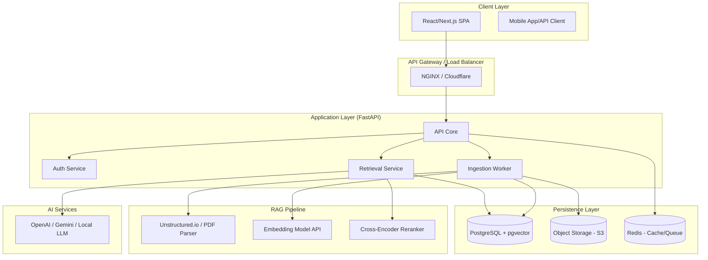
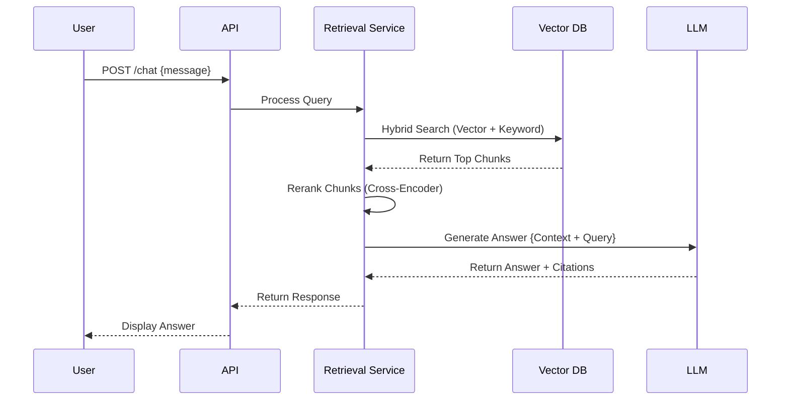

# Architecture Overview

## 1. High-Level Architecture
The Enterprise Knowledge Assistant (EKA) is built using a modern, decoupled architecture designed for high performance and scalability in AI workloads.

## 2. RAG Pipeline Detail
The RAG (Retrieval-Augmented Generation) pipeline is the heart of the system. It follows a multi-stage process to ensure high-fidelity answers.

### Data Ingestion Flow (ETL)
1. **Load:** Documents are uploaded to S3.
2. **Transform:** Raw text is extracted and metadata is attached.
3. **Chunk:** Text is split into overlapping chunks (Recursive Character Splitting).
4. **Embed:** Chunks are converted to 1536-3072 dimensional vectors.
5. **Index:** Vectors and metadata are stored in PostgreSQL using `pgvector` with HNSW indexes.

### Query & Generation Flow
1. **Pre-processing:** User query is cleaned and potentially expanded using an LLM.
2. **Hybrid Retrieval:**
    - **Vector Search:** Finds semantic matches in `pgvector`.
    - **Keyword Search:** Finds exact matches via BM25.
3. **Reranking:** Top 20 results are scored by a Cross-Encoder model.
4. **Context Assembly:** Top 5 chunks are formatted into a prompt context.
5. **Generation:** LLM generates an answer with instructions to use citations.
6. **Post-processing:** Citations are verified against the original sources before returning to the user.

## 3. Sequence Diagram: Chat Request

## 4. Infrastructure Diagram
The system is designed to be cloud-agnostic but optimized for Kubernetes (K8s) environments.

- **Frontend:** Distributed via CDN (Vercel/Cloudflare).
- **Backend:** Scalable Pods in a K8s cluster.
- **Database:** Managed PostgreSQL (AWS RDS / GCP Cloud SQL).
- **Compute:** GPU Nodes for local Embedding/Reranking models (optional).
