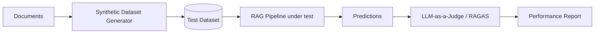

# RAG Evaluation Framework

## 1. Methodology
To ensure the Enterprise Knowledge Assistant provides reliable and accurate information, we employ a multi-layered evaluation strategy. We move beyond "vibes-based" testing to empirical, automated benchmarks.

## 2. Core Metrics (RAGAS)
We utilize the **RAGAS (RAG Assessment)** framework to measure the quality of our pipeline.

### Retrieval Metrics
- **Context Precision:** Measures the signal-to-noise ratio of the retrieved chunks. Target: **> 0.90**.
- **Context Recall:** Measures if all the information required to answer the question was actually retrieved. Target: **> 0.95**.

### Generation Metrics
- **Faithfulness (Groundedness):** Measures if the answer is derived purely from the retrieved context without hallucinations. Target: **> 0.85**.
- **Answer Relevance:** Measures how well the generated answer addresses the user's query. Target: **> 0.90**.

## 3. Traditional IR Metrics
- **Recall@K:** Percentage of relevant documents found in the top K results.
- **MRR (Mean Reciprocal Rank):** Evaluates where the first relevant chunk appears in the ranked list.

## 4. Evaluation Dataset Strategy
We maintain a "Golden Dataset" consisting of:
1. **Human-Curated Pairs:** Questions and reference answers created by subject matter experts.
2. **Synthetic Pairs:** Automatically generated Question/Context/Answer triplets using LLMs (e.g., GPT-4o) from our document corpus.
3. **Edge Cases:** Probing questions designed to trigger hallucinations or test guardrails.

## 5. Automated Evaluation Pipeline

## 6. Example Evaluation Result
| Metric | Score | Status |
|--------|-------|--------|
| Faithfulness | 0.89 | ✅ Pass |
| Answer Relevance | 0.92 | ✅ Pass |
| Context Precision | 0.84 | ⚠️ Optimize Reranker |
| Hallucination Rate | 2.5% | ✅ Pass (< 5%) |

## 7. Continuous Improvement
Evaluation is performed:
- **On Commit:** Small test set for regression testing.
- **Weekly:** Full evaluation on the entire Golden Dataset.
- **Post-Deployment:** Monitoring "Thumbs Up/Down" feedback from real users to identify new edge cases.
